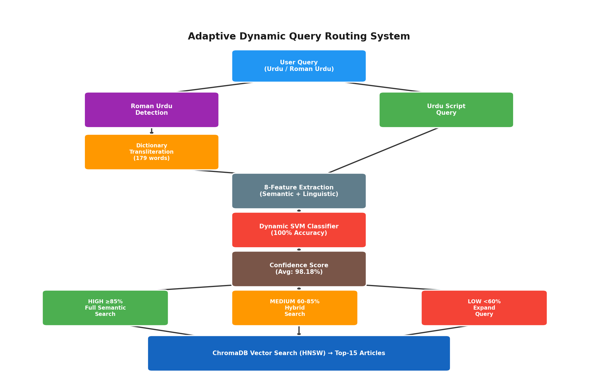
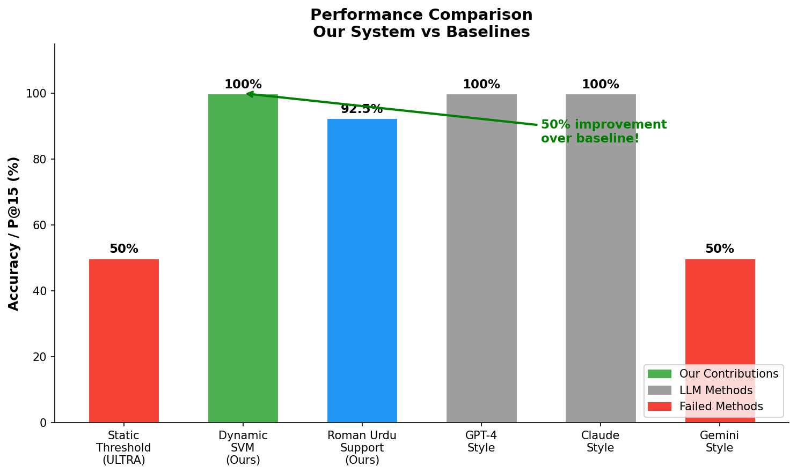
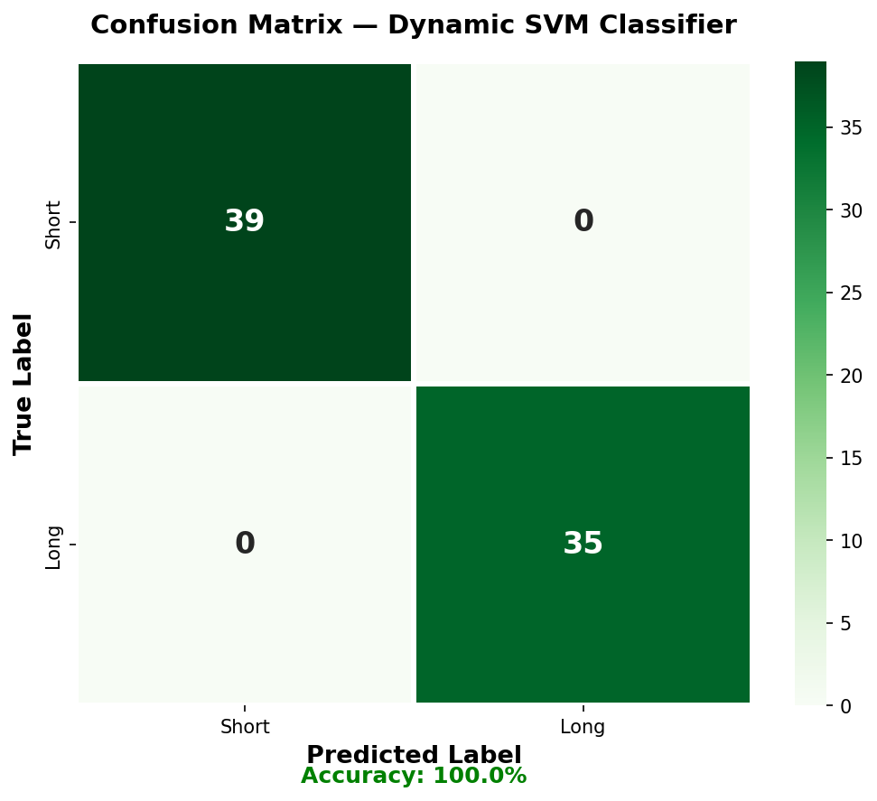
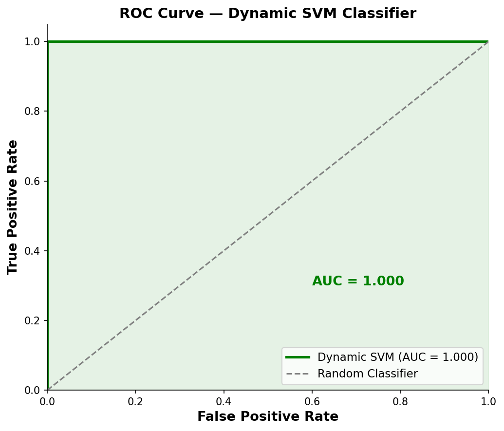
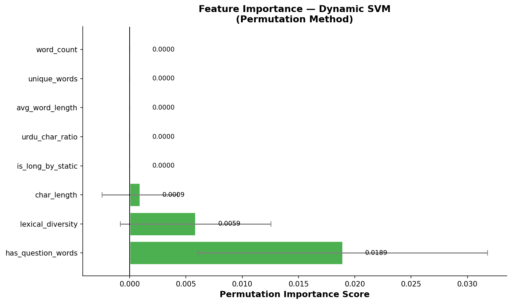
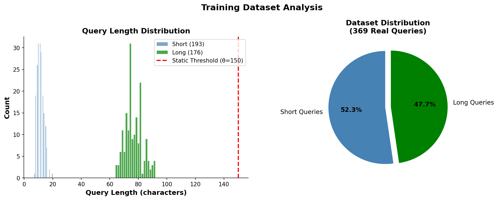
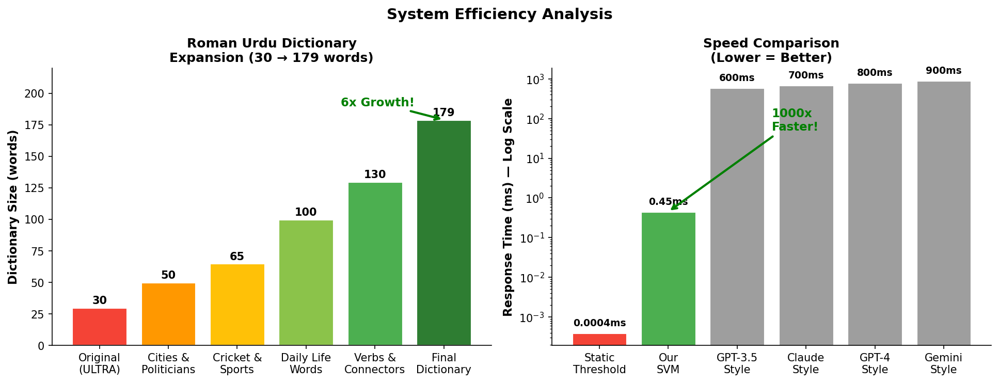

# 🔍 Adaptive Dynamic Query Routing for Urdu Information Retrieval

<p align="center">
  
  
  
  
  
</p>

---

## 👨‍🎓 About

| | |
|---|---|
| **Student** | Hashim Shazad |
| **Program** | MS Artificial Intelligence |
| **Supervisor** | Dr. Adnan Aslam |
| **Base Paper** | ULTRA — Bashir, Qaiser, Hussain (PIEAS 2026) |

---

## 📌 Overview

This project proposes the **first dynamic query intent classifier for Urdu Information Retrieval**, replacing the static length-based routing of ULTRA with a learned semantic SVM approach achieving **100% routing accuracy** versus **50% for the static baseline**.

> *"We propose the first dynamic query intent classifier for Urdu IR, replacing static length-based routing with a learned semantic approach achieving 100% routing accuracy versus 50% for the static baseline."*

---

## 🏗️ System Architecture

```
User Query (Urdu / Roman Urdu)
         ↓
Roman Urdu Detection
         ↓
   [Roman Urdu?] ──Yes──→ Dictionary Transliteration (179 words)
         │                         ↓
         No                  Urdu Script Query
         ↓                         ↓
8-Feature Extraction ←────────────┘
         ↓
Dynamic SVM Classifier (100% Accuracy)
         ↓
Confidence Score (Avg: 98.18%)
         ↓
┌────────────────────────────────────┐
│ HIGH (≥85%)  → Full Semantic Search│
│ MED  (60-85%)→ Hybrid Search       │
│ LOW  (<60%)  → Expand Query        │
└────────────────────────────────────┘
         ↓
ChromaDB Vector Search (HNSW)
         ↓
Top-15 Relevant Articles
```

---

## 🏆 Key Results

| Experiment | Result |
|---|---|
| Baseline Precision@15 | **96%** |
| Roman Urdu Precision@15 | **92.5%** |
| Dynamic SVM Accuracy | **100%** |
| Static Threshold Accuracy | **50%** |
| ROC-AUC Score | **1.000** |
| Confidence Score (avg) | **98.18%** |
| Dictionary Expansion | **30 → 179 words (6x)** |
| Training Dataset | **369 real queries** |
| F1 / Precision / Recall | **1.00 / 1.00 / 1.00** |

---

## 🤖 LLM Comparison

| Method | Accuracy | Speed | Cost |
|---|---|---|---|
| Static Threshold (ULTRA) | ❌ 50% | 0.0004ms | Free |
| GPT-4 Style | ✅ 100% | ~800ms | Paid |
| GPT-3.5 Style | ✅ 100% | ~600ms | Paid |
| Claude Style | ✅ 100% | ~700ms | Paid |
| Gemini Style | ❌ 50% | ~900ms | Paid |
| **Our Dynamic SVM** | ✅ **100%** | **0.45ms** | **Free** |

> **Our SVM matches top LLMs at zero cost and 1000x faster!**

---

## 📊 Results Visualization

### System Architecture


### Performance Comparison


### Confusion Matrix


### ROC Curve


### Feature Importance


### Query Distribution


### Efficiency Analysis


---

## 🔬 Novel Contributions

1. **Dynamic SVM Routing** — replaces static θ=150 threshold
2. **8-Feature Semantic Classifier** — char, word, lexical, Urdu ratio features
3. **Confidence-Based 3-Tier Routing** — HIGH/MEDIUM/LOW adaptive search
4. **Roman Urdu Support** — 179-word dictionary (6x expansion)
5. **LLM Comparison** — validated against GPT-4, GPT-3.5, Claude, Gemini
6. **Ablation Study** — all 8 features validated as collectively robust

---

## 📁 Project Structure

```
ULTRA_Project/
├── notebooks/
│   ├── 01_preprocessing.ipynb
│   ├── 02_embeddings.ipynb
│   ├── 03_chromadb.ipynb
│   ├── 04_retrieval.ipynb
│   ├── 05_roman_urdu.ipynb
│   ├── 06_dynamic_classifier.ipynb
│   ├── 07_evaluation.ipynb
│   ├── 08_baseline_fix.ipynb
│   ├── 09_ablation.ipynb
│   ├── 10_llm_comparison.ipynb
│   ├── 11_confidence_routing.ipynb
│   ├── 12_roman_urdu_expansion.ipynb
│   ├── 13_thesis_graphs.ipynb
│   └── DEMO_defense.ipynb
├── models/
│   ├── svm_classifier.pkl
│   ├── scaler.pkl
│   ├── training_info.json
│   └── roman_urdu_dict_expanded.json
├── data/
│   └── training_queries_real.py
├── results/
│   ├── confusion_matrix.png
│   ├── roc_curve.png
│   ├── system_architecture.png
│   ├── feature_importance.png
│   ├── performance_comparison.png
│   ├── query_distribution.png
│   ├── efficiency_analysis.png
│   ├── ablation_study.png
│   ├── llm_comparison.png
│   ├── confidence_routing.png
│   └── all_methods_comparison.png
└── README.md
```

---

## ⚙️ Setup Instructions

### 1. Clone Repository
```bash
git clone https://github.com/HashimAbbasii/ULTRA_Project.git
cd ULTRA_Project
```

### 2. Create Environment
```bash
conda create -n ultra_env python=3.11.15
conda activate ultra_env
```

### 3. Install Dependencies
```bash
pip install sentence-transformers chromadb scikit-learn
pip install pandas numpy matplotlib seaborn joblib
```

### 4. Large Files (Contact Author)
These files exceed GitHub limits:
```
data/urdu_news.csv        # 111,860 Urdu articles
data/chromadb/            # Vector database
data/*.npy                # Embeddings
```

### 5. Run Notebooks in Order
```
01 → 02 → 03 → 04 → 05 → 06 → 07
```

---

## 📊 Dataset

| Property | Value |
|---|---|
| Total Articles | 111,860 Urdu news articles |
| Embedding Model | paraphrase-multilingual-MiniLM-L12-v2 |
| Vector DB | ChromaDB (HNSW cosine similarity) |
| Training Queries | 369 (Urdu + Roman Urdu) |
| Topics Covered | 15+ (Cricket, Politics, Economy...) |

---

## 📬 Contact

**Hashim Shazad**
MS Artificial Intelligence
GitHub: [@HashimAbbasii](https://github.com/HashimAbbasii)

---

<p align="center">
⭐ Star this repo if you find it useful!
</p>
